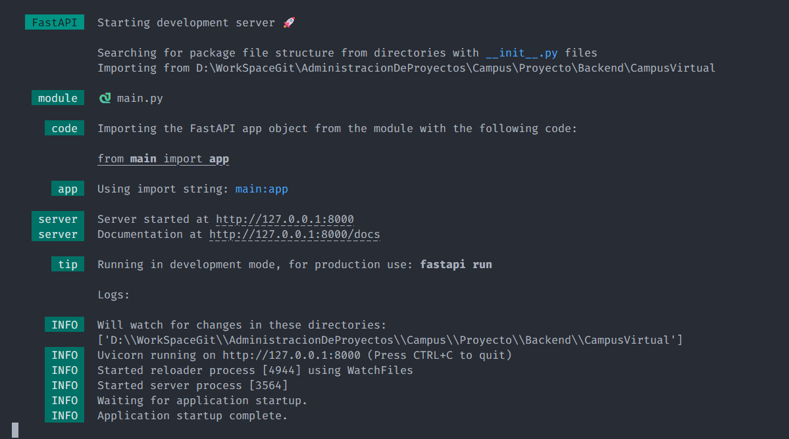
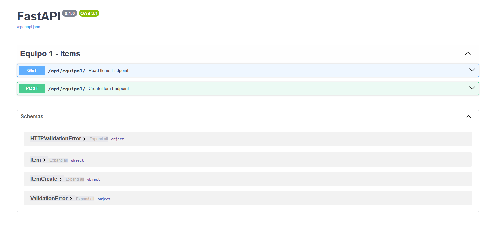
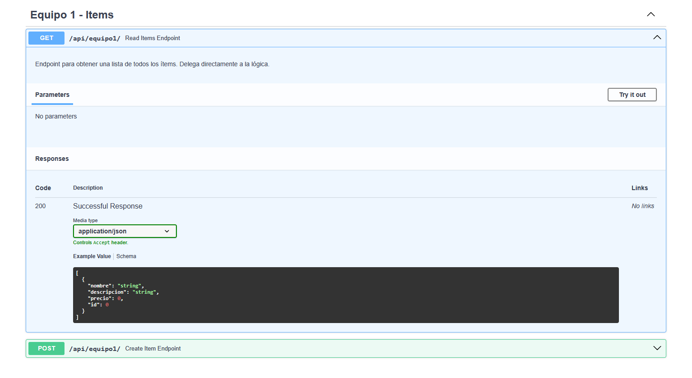
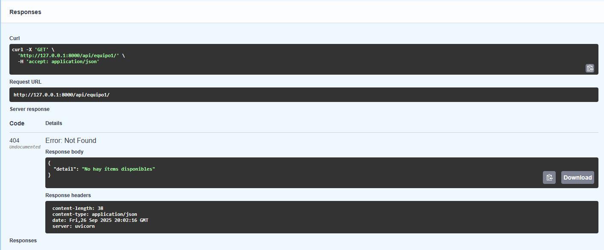
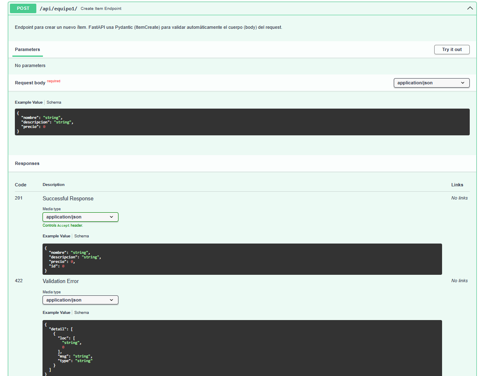
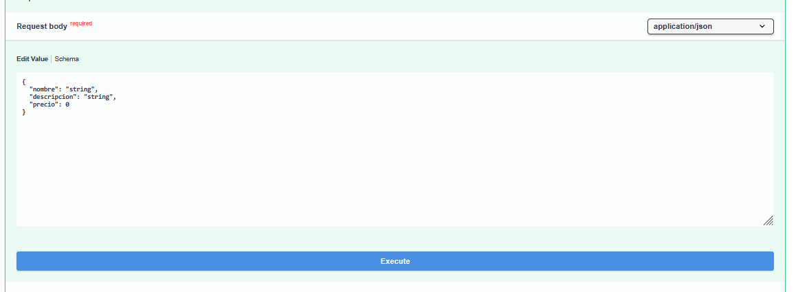
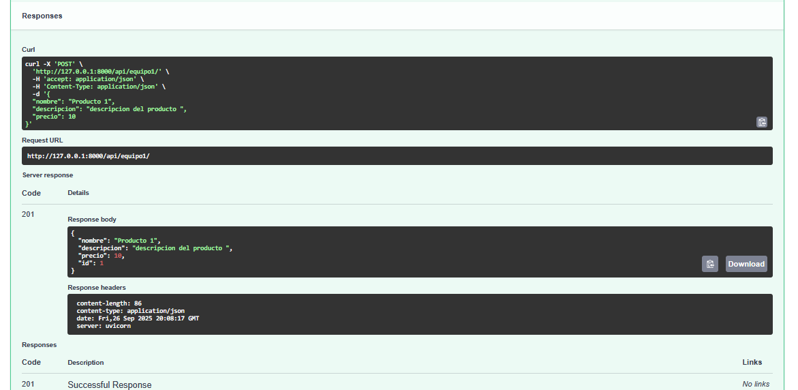

# Campus Virtual Backend

----

## Instalación

### Requisitos

Para el funcionamiento del proyecto, necesitas descargar python 3.13

[https://www.python.org/downloads/](https://www.python.org/downloads/)

Una vez descargado, puedes ejecutar este comando para verificar que se instaló correctamente:

```bash
py --version
```

Te deberá mostrar la versión **Python 3.13.X**.

----

### Entorno virtual

Para trabajar en este proyecto estaremos usando un entorno virtual esto es recomendado ya que asi se contrala mejor las librerias de python que se usan de forma personca y las de este proyecto

Primero nos tenemos que dirigir a la carpeta : `< Tu ruta donde tengas el repo> \Proyecto\Backend\CampusVirtual` y ya nos quedaremos en esa carpeta

Ya dentro de esa carpeta en la terminal ejecutamos el siguiente comando

```bash
py -m venv campus_venv
```

esto creeara una carpeta llamada `campus_venv` si quieres que se llame de otra forma puedes cambiarla eso es el nombre del entorno virtual y eso es en cada maquina.

Para activarlo se ejecuta el siguiente comando:

```bas
campus_venv\Scripts\activate
```

Si le cambiaste el nombre al entorno tambien se lo tienes que cambiar para ver si es que esta activado , en tu terminal podras ver que dice `(campus_venv)` hasta la izquierda, es decir a la izquierda del disco en el que estes, es decir se veria asi

`(campus_venv) C:\< Tu ruta donde tengas el repo> \Proyecto\Backend\CampusVirtual`

y para salirte del entorno solo usas este comando

```bash
deactivate
```

Vuelve a meterte al entorno virtual y ahora puedes hacer el compando `pip list` y veras que no tienes nada en ese entorno asi que para instalar todo lo necesario puedes hacer este comando

```bas
pip install -r requirements.txt
```

lo que hace ese comando es que va a leer el archivo  requirements.txt y va a instalar todo lo que tenga adentro con el comando `pip install` todas esas librerias se descargan automaticamente al momento de hacer `pip install "fastapi[standard]"`, pero en caso de que ocupemos mas cosas o otra libreria se agregaria al archivo  requirements.txt y ya con eso se descargan las que falten, para probar que tengas todo instalado has `pip list`

ahora una vez que estes dentro del entorno y con todo instalado puedes hacer este comando

```bas
fastapi dev
```

ese comando lo que hace es levanarte el proyecto de fastapi ejecutando el archivo `main.py` y si todo te sale bien deberias ver este mensaje en la terminal



eso significa que todo funciono y que se levanto en el puerto `http://127.0.0.1:8000` a esa direccion la llamaremos desde el front y para ver la documentacion dale ctrl+click a `http://127.0.0.1:8000/docs` esta te llevara a una documentacion con swager de las apis que tengas y te debera aparece esto:



Desde aqui podemos probar las apis sin necesidad de tener que estarlas llamando desde el frotn, tambpien puedes usar otros como thunder client o postman, pero vamos a ver este de una vez.

Primero se ven todas las apis agrupadas por `tags` en este caso la unica `tags` que existe es la de Equipo 1 - item, ahi podras ver las apis que estan hacia esa tag que podemos ver que es una peticion get y otra post si a cualquiera le damos a la flecha que esta a la dercha veremos un menu para probar las apis, si le damos a la peticion Get veremos esto



ahi podemos ver que es lo que nos va a regresar que en este caso es un json con este formato

```json
[
  {
    "nombre": "string",
    "descripcion": "string",
    "precio": 0,
    "id": 0
  }
]
```

es decir es una lista y dentro de esa lista esta un objeto con esas propiedades y el tipo de valor, para probarla le podemos dar al boton que dice `Try it out` y luego al `Execute` (en este caso al ser una peticion get no pide parametros asi que le puedes dar sin problema) no nos traera nada mas que un objeto vacio porque aun no tenemos nada pero nos aparecera lo siguiente.



Esa aprte de `Responses` es lo que nos regreso priemero podemos ver el `Request URL` a la que le pedimos la peticion get que es `http://127.0.0.1:8000/api/equipo1/` y luego lo que nos regra en este calo al no encontrar nada nos regreso en los detal que no hay items disponibles.

ahora si nos vamos a la peticion Post veremos esto



y si le damos a `Try it out` veremos que ahora si pide algo que es el request body



Como es una peticion Post se es neceario llenar esos datos y que se envien esos datos y luego ya le puedes dar en `Execute` despues de darle execute veras el respose esto



si te das cuenta el `reequest url` es el mismo pero el metode (post, get) es lo que lo difernecia, si ahora regresamos al metodo get veremos que nos regresa el que acabamos de insertar el el metodo post, no es 100% necesario que se aprenand que hace cada una, pueden hacer puras peticiones post, pero eso es para que se etnienda que son diferentes.
