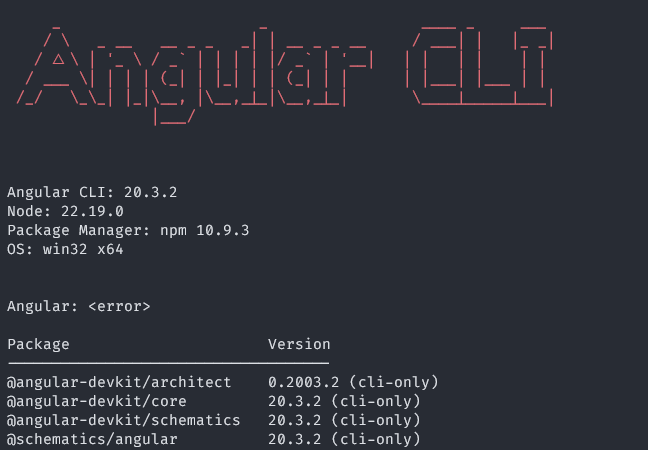
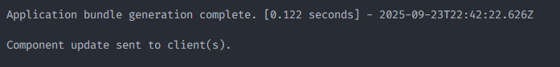

# Campus Virtual Frontend

-----

## Instalación

### Requisitos

Para el funcionamiento del proyecto, necesitas descargar **Node.js v22.19.0 (LTS)**.

[https://nodejs.org/es/download](https://nodejs.org/es/download)

Una vez descargado, puedes ejecutar este comando para verificar que se instaló correctamente:

```bash
node -v
```

Te deberá mostrar la versión **v22.19.0**.

-----

### Angular CLI

Luego podrás instalar Angular CLI. Estaremos usando la versión 20.

```bash
npm install -g @angular/cli
```

Para verificar que se instaló correctamente, puedes usar este comando:

```bash
ng version
```

Te deberá mostrar algo como esto:



Dentro del proyecto, encontrarás los archivos para que se ejecute Angular. Asegúrate de tener la carpeta **`node_modules`**. En caso de que no la tengas, puedes ejecutar este comando en la terminal, en la ruta **`\Proyecto\FrontEnd\CampusVirtual`**:

```bash
npm install
```

-----

## Levantar el Frontend

A partir de aquí, siempre nos quedaremos en esta ruta: `< Tu ruta donde tengas el repo >\Proyecto\FrontEnd\CampusVirtual>`. Para ejecutar el programa, solo tenemos que hacer:

```bash
ng serve -o
```

El `ng serve` es para que se ejecute y el `-o` es para que se abra automáticamente en tu navegador. Existen más configuraciones, pero con eso es suficiente para levantar el *front*. Por defecto, se estará levantando en:

[http://localhost:4200/](https://www.google.com/search?q=http://localhost:4200/)

Para saber que se levantó con éxito, en la terminal donde hiciste el `ng serve` deberán aparecerte estas dos últimas líneas:



-----

## Crear Componentes

Ahora podrás ver que dentro de `src/app/` están los componentes. En `/home` estará el principal, es decir, de ahí verás cómo ir de un módulo a otro. En `/modules` estarán los módulos por equipo. Prácticamente, esos serán en los que más estaremos trabajando, cada equipo en su respectiva carpeta. **No debería ser necesario modificar los demás archivos**.

Para crear un nuevo componente, pueden usar este comando:

```bash
ng g c modules/equipoX/src/hola-equipoX --skip-tests
```

* `ng`: es el comando para Angular
* `g`: es la abreviatura de `generate`
* `c`: es la abreviatura de `component`

Con esas 3 "palabras" ya estás diciendo que se genere un componente, y con lo siguiente es para definir las rutas:

* `modules/`: es la carpeta `modules` que se encuentra en `src/app/modules`
* `equipoX/`: es el módulo en el que vas a trabajar (equipo1, equipo2, ...)
* `src/`: es la carpeta dentro del módulo
* `hola-equipoX`: es el nombre del componente que quieras crear. Por defecto, te creará la carpeta con su nombre y dentro de ella estarán un `.css`, `.html`, y dos `.ts`. El segundo es para pruebas (le puedes poner el nombre que tú quieras).

Ya con eso es más que suficiente. Con eso ya te creará un componente. Lo que quieras poner después es adicional, como esto:

* `--skip-test`: es para evitar que se cree el segundo `.ts` que es para hacer las pruebas. Si quieres, lo puedes quitar y usarlo, pero no es necesario.

-----

## Cómo son las Rutas

Primero será necesario que levantes el proyecto y veas qué hacen los botones y te fijes en las rutas. Prácticamente, la ruta definirá qué módulo se cargará.

Primero, veamos cómo se definieron las rutas de los botones. Esas rutas se definen en el archivo que se encuentra en `src/app/app.routes.ts`. Ese carga las rutas principales: `/home`, `/equipo1`, `/equipo2`, `/equipo3`, `/equipo4`.

Si se fijan, prácticamente solo nos interesará el diccionario `routes : Routes`.

Este diccionario está conformado por:

* `path`: que es la ruta que se mostrará para acceder al componente
* `component`: que es el componente al que se accederá mediante la ruta

Uno depende del otro. Aún no le hagas tanto caso a cómo definí los componentes de los módulos. Vamos a ver solo estas dos por mientras:

```bash
{ path: '', redirectTo: '/home', pathMatch: 'full' },
{ path: 'home', component: Home },
```

En la primera está la ruta vacía, pero esto es para decir que si no se ingresa nada, que la redirija a `/home`. La segunda línea está diciendo qué componente se tendrá que abrir cuando accedan a `/home`, que es el componente `Home` (los componentes son sensibles a mayúsculas y minúsculas). Aquí, para importar es fácil; solo es de esta forma:

```bash
import { Home } from './home/home';
```

Donde dices `import`, luego entre llaves qué es lo que quieres importar, y luego le dices de dónde. Si hay más componentes dentro de esa misma carpeta, solo los pones dentro de las llaves.

-----

## Cómo hago mi componente visible

Una vez que ya hayas creado tu componente, te tendrás que ir al:

```bash
src/app/modules/equipoX/equipoX-routing-module.ts
```

En `equipoX-routing-module.ts`, es donde se definen las rutas del módulo. Si recuerdas, en `app.routes.ts` le hablamos a ese archivo de una forma, pero aquí no nos tendremos que preocupar de eso. Aquí solo vamos a agregar la ruta de cómo queremos acceder a ese componente y su nombre.

### Práctica

Crea un componente en la carpeta de tu equipo **(cambia `equipoX` por `equipo1`, `equipo2`, etc...)**:

```bash
ng g c modules/equipoX/src/HolaMundo --skip-tests
```

Ahora dirígete al `RoutingModule` de tu equipo `src/app/modules/equipoX/src/equipoX-routing-module.ts` y agrega una ruta a tu componente:

```bash
{
    path: 'holaMundoPath',
    component: HolaMundo,
}
```

Y ahora podrás entrar a tu componente (recuerda cambiar la `X` por el número de tu equipo):

[http://localhost:4200/equipoX/holaMundoPath](https://www.google.com/search?q=http://localhost:4200/equipoX/holaMundoPath)

Y así podrás ver el contenido de tu componente.
